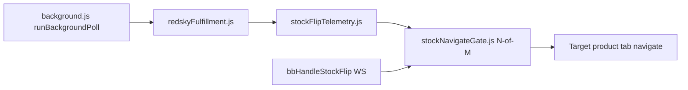

# LLM handoff — consolidated release (extension v2.5.0)

> **Audience:** Next Cursor/Cloud agent picking up BEATBOTS after this PR merges to `main`.  
> **PR:** Single consolidated PR replacing #28, #29, #32, #33, #34 (close those after merge).  
> **Branch:** `cursor/release-handoff-4bbd` → `main`

---

## What shipped (20 commits ahead of `main`)

| Area | Version | Summary |
|------|---------|---------|
| Checkout reliability | 2.1.0+ | Pre-auth warmup, modal continue, fresh-tab checkout, API bypass poll loop, cart confirm, bounce recovery |
| BEATBOTS WS pool | — | Shape inject before ATC; OTP via WS; `MonitorEngine` `stock_flip` sidecar |
| Anti-detection | 2.3.0 | Tier A1–A6/A8 + B2: poll jitter, pre-drop guards, native clicks, debugger detach, hype fresh-tab, WS `checkout_request` fallback |
| Stock monitor Phase 1 | 2.4.0 | Monitor window, `isAggressivePoll`, RedSky fulfillment URLs, flip telemetry, operator guide, `bbHandleStockFlip` |
| Stock monitor Phase 2 | 2.5.0 | Batch fulfillment map, keyword watch (PLP search), N-of-M navigate gate (default 2-of-3) |
| Overnight @it loop | — | Canonical `IT_LOOP_PROMPT.md`, `autopilot-overnight.sh` wiring, DRY_RUN unset fix |

**Extension manifest:** `target-checkout-helper/manifest.json` → **2.5.0**

---

## Key files (read these first)

| Path | Role |
|------|------|
| `target-checkout-helper/dropPollingTiming.js` | Drop window + `isAggressivePoll` / `isInMonitorWindow` |
| `target-checkout-helper/core/redskyFulfillment.js` | Fulfillment URLs, batch map, PLP search parse |
| `target-checkout-helper/core/stockFlipTelemetry.js` | Flip recording + popup `lastStockFlips` |
| `target-checkout-helper/core/stockNavigateGate.js` | N-of-M confirm before navigate on flip |
| `target-checkout-helper/background.js` | `runBackgroundPoll`, keyword merge, navigate gate, `bbHandleStockFlip` |
| `target-checkout-helper/popup.html` / `popup.js` | Window fields, keyword watch, confirm N/M |
| `docs/autopilot/IT_LOOP_PROMPT.md` | Canonical @it overnight session prompt |
| `docs/autopilot/stock-monitor-research/STOCK-MONITOR-PHASE1-SCOPE.md` | Phase 1 scope (docs) |
| `docs/autopilot/field-observations/DROP-FIELD-OBSERVATIONS.md` | Operator field notes |
| `tasks/NEXT_TASK.md` | Operator next steps |
| `tasks/lessons.md` | Standing rules (@it → senior dev skill) |

---

## Verification (must pass before claiming done)

```bash
bash scripts/verify.sh
node scripts/stock-monitor-test.mjs
node scripts/anti-detection-test.mjs
python3 -m orchestrator autopilot use docs/autopilot/stock-monitor-research/stock-monitor-research.json
python3 -m orchestrator autopilot status   # expect 6/6 complete
python3 -m orchestrator autopilot use docs/autopilot/stock-monitor-research/stock-monitor-phase2.json
python3 -m orchestrator autopilot status   # expect 3/3 complete
```

**Baseline at handoff:** `verify.sh` ALL PASSED (2026-06-27).

---

## Overnight loop (host with credentials)

```bash
export CURSOR_API_KEY=...   # required — no auth = exit, not dry-run simulation
export PATH="$HOME/.local/bin:$PATH"
./scripts/loop.sh --detach
tmux -f /exec-daemon/tmux.portal.conf attach -t autopilot-overnight
```

- Default task: `docs/autopilot/overnight/repo-health.json` (6 reqs; refresh resets `passes` to false)
- Custom task: `./scripts/loop.sh --task docs/autopilot/stock-monitor-research/stock-monitor-phase2.json --detach`
- Logs: `docs/autopilot/overnight/logs/`
- Append session notes: `docs/autopilot/overnight/overnight-notes.md`

---

## Standing user rules

- **`@it`** → Read `.cursor/skills/senior-singulr-dev/SKILL.md` + `.cursor/commands/it.md`; narrate Observing → Hypothesis → Action → Result.
- Log patterns in `tasks/lessons.md` after corrections.

---

## Open PRs to close after this merge

| PR | Branch | Superseded by |
|----|--------|---------------|
| #28 | `cursor/anti-detection-impl-4bbd` | This PR |
| #29 | `cursor/stock-monitor-phase1-scope-4bbd` | Scope doc included here |
| #32 | `cursor/stock-monitor-phase1-4bbd` | This PR |
| #33 | `cursor/stock-monitor-phase2-4bbd` | This PR |
| #34 | `cursor/overnight-it-loop-4bbd` | This PR |

---

## Deferred / not in scope

- **Phase 3 scale:** Headless poller fleet at scale (PRD only).
- **Live Target rehearsal in cloud:** Auth modal blocks automated sign-in; manual sign-in acceptable.
- **Discord webhook:** User explicitly declined; extension uses pre-monitor + WS sidecar instead.
- **Sync `IT_LOOP_PROMPT.md`** to Windows Telegram-bot repo (`D:\repos\Telegram bot\docs\autopilot\IT_LOOP_PROMPT.md`) — manual on dev machine.

---

## Operator checklist after merge

1. `chrome://extensions` → reload **Target Checkout Helper** (v2.5.0).
2. Set **Expected drop time** + **Monitor window** for window drops; enable **Aggressive while monitor on** if desired.
3. Optional **Keyword watch** for PLP-driven TCIN discovery.
4. One Target tab, clear cart before drop; pre-monitor beats Discord latency for window drops.
5. `CURSOR_API_KEY` on overnight host before `./scripts/loop.sh --detach`.

---

## Autopilot task completion state

| Task JSON | Status |
|-----------|--------|
| `stock-monitor-research.json` | 6/6 complete |
| `stock-monitor-phase2.json` | 3/3 complete |
| `repo-health.json` | 0/6 (refreshed for next overnight cycle) |
| `anti-detection.json` | Check with `autopilot status` after `autopilot use` |

---

## Architecture sketch (stock flip → checkout)



---

*Last updated: 2026-06-27 — consolidated release handoff.*
