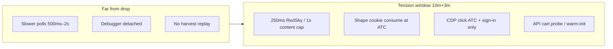

# Anti-detection research & mitigation plan

**Audience:** `@it` / head dev — drop-night engineering  
**Scope:** Target.com + Walmart.com — how we get flagged, what to change, what to keep fast  
**Status:** Research + plan only (no code changes in this doc)

---

## Executive summary

Retailers do not maintain a single “bot score.” They fuse **client instrumentation** (Shape, PerimeterX, in-page JS), **session graphs** (cookie age, IP, device, cart/checkout velocity), and **server-side rate limits** on the same JSON APIs our extension calls. Our architecture is already **more human-like than API-only bots** on checkout (real DOM, real cookies, real navigation), but we carry **visible automation surfaces** that commercial stacks hide behind separate processes, proxies, and active Shape solvers.

**Highest-risk signals in our tree today:**

| Rank | Signal | Retailer | Performance if removed naïvely |
|------|--------|----------|--------------------------------|
| 1 | Missing `cookies` / `browsingData` manifest permissions | Target | Harvest + session recovery silently broken → *worse* outcomes |
| 2 | `chrome.debugger` stays attached through checkout | Target | Detach after ATC → lose trusted clicks on hot buttons |
| 3 | Passive cookie replay vs active Shape generation | Target hype | Gate without pool → miss drops |
| 4 | 250ms background RedSky loop in tension window | Target | Slow to 1s+ → miss first ATP |
| 5 | `wmDirectAtc` flat 200ms POST retry | Walmart | Jitter → +50–150ms to first success |
| 6 | `window.WebSocket` constructor patch | Walmart queue | Remove → +0.5–1s queue reaction |
| 7 | Synthetic `fillInput` (no `isTrusted`) on checkout forms | Both | CDP typing everywhere → slower + CDP banner |

**Strategy:** Tier mitigations so **speed is preserved only inside the drop tension window** (10m pre / 3m post), and **stealth improves everywhere else**. Do not slow the tension window without a measured substitute (e.g. BEATBOTS Shape pool, API warm-init already shipped).

---

## How Target flags automation

### 1. Shape Security (ATC / cart APIs)

Shape binds **short-lived, action-specific cookies** to a browser session that actually executed their JS. Industry pattern (Stellar, Refract): **actively solve** Shape in a real browser loop and **consume** cookies at ATC time.

**Our behavior:**

- Passive harvest via `chrome.cookies.getAll` (`cookieHarvest.js`) — snapshots whatever the profile already has.
- `maybeApplyShapeCookieForAtc()` prefers **BEATBOTS app pool** (`BB_APPLY_ATC_COOKIE`), else extension harvest replay.
- Hype mode **blocks ATC** until `hasShapePoolForHype()` passes (`content.js`).

**Pitfall:** Replaying a snapshot from a **different** tab/session or **stale** pool entry produces 403/empty cart — looks like credential stuffing, triggers harder challenges.

**Already mitigated:** Skip harvest apply after fresh ATC (`harvest apply skipped — fresh ATC keeps cart session`).

### 2. PerimeterX / visitor trust

Target uses PX-style visitor cookies (`_px*`, `pxcts`). Our session recovery **preserves** these across `browsingData` wipes (`background.js`).

**Pitfall:** Wiping without restore resets trust → login walls, checkout sign-in loops under load.

**Pitfall:** `browsingData` API is called but **`browsingData` is not in `manifest.json`** — recovery may no-op (`no_browsing_data_api`).

### 3. RedSky / web_checkouts API velocity

Background `runBackgroundPoll` uses `computeBackgroundPollSleepMs()` → **250ms** inside tension window (`dropPollingTiming.js`). Content stock watch can run **~400ms + jitter** (`T.retryWatchBaseMs`).

**Pitfall:** Identical interval polling is a cheap server-side fingerprint. 250ms × N TCINs from one IP during a drop is aggressive vs Stellar’s documented 8–15s monitor interval (they use many IPs).

**Mitigation already present:** Drop-aware tiers (2s far, 500ms normal, 250ms tension). Challenge text slows watches (`humanChallengeDelayMs: 12000`).

### 4. Chrome DevTools Protocol (`chrome.debugger`)

Every `debuggerClick()` auto-attaches via `tchDebuggerAutoAttach` (`background.js` → `debuggerBridge.js`). Chrome shows **“Chrome is being controlled by automated test software”** (debugger banner).

**Pitfall:** CDP attach is a first-class automation signal. Sites can correlate attach time with ATC/checkout clicks.

**Current use:** Bezier mouse paths + key events for ATC, sign-in, Place Order — good for `isTrusted`, bad for stealth while attached.

### 5. MAIN-world injection

`main_world.js` polls `window.__CONFIG__` every 250ms and sets `dataset.tchKey` on `<html>`. `walmart-main-world.js` replaces `window.WebSocket`.

**Pitfall:** Page scripts can compare `window.WebSocket !== native` or scan DOM for extension-specific attributes/events.

**Tradeoff:** MAIN world is **required** for RedSky key extraction and sub-second Queue-it detection — removing it costs performance.

### 6. Monitor + checkout same tab

Unlike Stellar’s split monitor/checkout tasks (`tasks/stellar-vs-us-comparison.md`), one tab goes from **high-frequency stock poll** → **ATC** → **checkout** on the same session.

**Pitfall:** Behavioral graph shows bot-like phase transition (inventory API hammer → single ATC → rapid checkout API warm-init).

**Mitigation path:** Fresh tab checkout (`OPEN_FRESH_CHECKOUT_TAB`) — already used on stuck flows; extend as **default for hype** without slowing monitor tab.

### 7. Checkout form fill

`fillInput()` uses native value setter + synthetic `input`/`change` events — **not** `isTrusted` (`content.js`).

**Pitfall:** React controlled inputs often accept this; fraud scripts may flag event trust mismatch on payment fields.

**Mitigation:** Keep CDP typing for **sign-in / password / OTP** only; use DOM fill for shipping (already faster). Payment: prefer **saved wallet** on account (`useSavedPayment`) to skip card fields.

---

## How Walmart flags automation

### 1. PerimeterX challenges

`walmart-content.js` detects `#px-captcha`, `px-block`, hang-tight copy. Popup claims DOM-only queue wait is safe; **direct ATC is not DOM-only**.

### 2. `wmDirectAtc` rapid retry

`POST /api/v3/cart/guest/{cid}/items` with **`wmSleep(200)`** between attempts when `rapidRetryMs > 0` — up to hundreds of requests in tens of seconds from one guest CID.

**Pitfall:** Classic velocity bot signature. PerimeterX scores guest cart API harder than reading disabled ATC button once per second.

### 3. WebSocket monkey-patch

`walmart-main-world.js` wraps `WebSocket` for Queue-it URLs only. Passive listener (no extra outbound traffic) — lower risk than ATC spam, but **detectable** if Walmart probes `WebSocket.toString()` or constructor identity.

### 4. Extension fingerprint

Manifest is narrow (`host_permissions` only `target.com` + `walmart.com`) — good. `debugger` permission is still a store/review signal.

---

## Codebase risk map (verified)

| Area | File(s) | Risk | Notes |
|------|---------|------|-------|
| Shape / harvest | `cookieHarvest.js`, `content.js` | High | Needs `cookies` permission |
| Session wipe | `background.js` | High | Needs `browsingData`; PX preserve logic good |
| Debugger attach | `debuggerBridge.js`, `background.js` | High | Auto-attach per click |
| RedSky poll | `dropPollingTiming.js`, `background.js` | Med–High | 250ms tension |
| API checkout bypass | `content.js` | Med | `warmInitTargetCheckout` — keep, don’t loop blindly |
| MAIN world key | `main_world.js` | Med | 250ms poll until key found |
| Walmart ATC | `walmart-content.js` | High | 200ms retry loop |
| Walmart WS | `walmart-main-world.js` | Med | Constructor patch |
| Form fill | `content.js` | Med | Synthetic events |
| Hype gate | `content.js` | Low (good) | Waits for Shape pool |

---

## Circumvention plan (performance-preserving)

### Design principle: **“Fast only in tension”**

### Tier A — Extension-only (ship first)

| # | Change | Detection win | Perf impact | Effort |
|---|--------|---------------|-------------|--------|
| A1 | Add `cookies` + `browsingData` to `manifest.json` | Harvest + recovery actually work | None | Trivial |
| A2 | **Debugger lifecycle:** attach only for ATC, sign-in, Place Order; **detach** after success + on `/checkout` shipping/payment when using `fillInput` | Removes banner during long checkout | None in tension | Small |
| A3 | **Click fallback ladder:** try `element.click()` first on low-risk buttons (Continue, decline coverage); CDP only if click didn’t advance step | Less CDP surface | −5–20ms per click | Small |
| A4 | **RedSky jitter:** add ±15–25% random to `computeBackgroundPollSleepMs` tension branch (keep mean 250ms) | Breaks exact interval fingerprint | Negligible | Small |
| A5 | **Walmart ATC backoff:** replace flat 200ms with `150 + random(0..100) + min(attempt*10, 200)` cap 500ms; max attempts unchanged | Cuts velocity score | +0–300ms first live response | Small |
| A6 | **Enforce ops defaults in popup:** hype requires pool ≥3, sign-in before drop, one tab — UI hints exist; add pre-drop guard toast | Prevents misconfig | None | Small |
| A7 | **Don’t replay harvest** after ATC or in checkout path | Already done — keep | None | — |
| A8 | **Fresh tab checkout default for hype** (monitor tab stays on PDP) | Splits behavioral graph | +1 tab open cost | Medium |

**Do not do in Tier A:** Remove tension 250ms polling, remove API warm-init, remove Queue-it WebSocket sniff.

### Tier B — BEATBOTS desktop (parallel track)

| # | Change | Detection win | Perf impact |
|---|--------|---------------|-------------|
| B1 | Shape harvester running **30+ min pre-drop** | Active cookies vs passive | Pool depth only |
| B2 | WS `checkout_request` → `CheckoutEngine.run()` when DOM degraded | API path like Stellar | Faster checkout, higher API velocity — use **only** when cart SPA dead |
| B3 | OTP via app IMAP (shipped Phase 2) | Less CDP typing at login | Faster sign-in |

### Tier C — Operational (no code)

| Practice | Why |
|----------|-----|
| Sign in **≥30 min** before drop | Avoids checkout auth modal under load |
| One Target tab, clear cart | Reduces session weirdness |
| Dedicated Chrome profile on beatbots runbook volume | Clean fingerprint per drop |
| No popup toggles in last 60s | Avoids storage races + SW restart |
| `useSavedPayment` ON | Skips untrusted card field events |
| BEATBOTS connected + pool counts in popup | Shape gate for hype |

---

## Performance budget (drop night)

| Phase | Target latency budget | Stealth knob |
|-------|----------------------|--------------|
| Stock detect → ATC click | &lt; 500ms after ATP | Shape cookie pre-applied |
| ATC → cart confirm | &lt; 2s API probe | No harvest swap |
| Cart → checkout | API bypass path | warm-init once, not loop |
| Checkout steps | 25ms DOM probe OK | CDP only on auth + Place Order |
| Walmart queue pass → ATC | &lt; 100ms WS event | Keep WS patch |
| Walmart OID live → cart | First 200ms retry OK with jitter | Cap concurrent fetches = 1 |

---

## Implementation backlog (recommended order)

1. **A1** manifest permissions — unblocks harvest/recovery  
2. **A2 + A3** debugger scope — biggest stealth/perf ratio  
3. **A4** poll jitter — one function change  
4. **A5** Walmart backoff — isolated to `wmDirectAtc`  
5. **A8** hype fresh-tab default — config flag + docs  
6. **B2** API checkout WS — only after A1–A5 verified on a live drop  

Each item should ship with:

- `node --check` on touched files  
- `bash scripts/verify.sh`  
- Entry in `tasks/lessons.md` if drop behavior changes  

---

## What we should NOT do

| Idea | Why |
|------|-----|
| Slow tension polling to 2s+ globally | Loses drops; use jitter not mean shift |
| Remove API warm-init / cart probe | Reload loops are *more* suspicious + slower |
| CDP-type every checkout field | Slower, keeps debugger attached longer |
| Hammer Shape harvest bursts during tension | Shape rate-limits; use BEATBOTS pool |
| Proxy in extension without architecture | `chrome.proxy` won’t split monitor/checkout like Stellar |
| Hide debugger banner with CSS | Doesn’t remove CDP signal |
| Replay cookies every navigation | Session mismatch → 403 cascades |

---

## Verification matrix (post-implementation)

| Test | Pass criteria |
|------|----------------|
| Manifest | `cookies` + `browsingData` present; harvest + recovery succeed in DevTools |
| Debugger | Banner absent on shipping/payment steps; present only during ATC test |
| Tension poll | Mean interval ~250ms, stdev &gt; 30ms over 100 samples (`checkout-speed-test.mjs` extend) |
| Walmart rapid | Log shows increasing gaps; no &gt;5 identical 200ms gaps |
| Hype | ATC blocked with 0 pool; proceeds with BEATBOTS inject |
| Drop rehearsal | `SHIP-TONIGHT.md` checklist + Tier A SKUs on staging account |

---

## Related docs

- `tasks/stellar-vs-us-comparison.md` — Shape / split-task gap  
- `docs/autopilot/checkout-reliability/CHECKOUT-BYPASS-RESEARCH.md` — API bypass (keep)  
- `research_target_checkout_bots/findings_technical_patterns.md` — industry patterns  
- `docs/autopilot/target-toolstack/CHROME-PROFILES-RUNBOOK.md` — profile hygiene  

---

## Open questions for product

1. **Hype default:** Block extension ON without BEATBOTS pool, or warn only?  
2. **Walmart rapid mode:** Auto-disable outside last 2m before expected drop?  
3. **API checkout in extension:** Never vs WS-delegated only when DOM fails?  

---

*Branch: `cursor/anti-detection-research-4bbd` · Plan only — implementation tracked in `anti-detection.json`*
