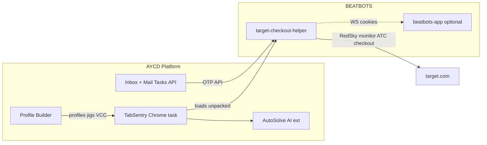

# AYCD integration — research & brainstorm

**Boss:** @it | **Date:** 2026-06-27 | **Sources:** [aycd.io](https://aycd.io/), Zendesk docs, Discord pass screenshots, BEATBOTS extension codebase, Refract/WM+ community notes

---

## Executive summary

**AYCD is infrastructure; our extension is the checkout engine.**

AYCD does **not** replace Target RedSky monitoring or our checkout DOM flow. It fills gaps we intentionally do not build: **multi-browser sessions**, **captcha hubs**, **centralized OTP/IMAP**, **profile/VCC jigs**, and **account farming** (OneClick).

**Fastest win (no code):** Load **Target Checkout Helper** as an unpacked extension inside **TabSentry** (Chrome/Brave tasks), plus **AutoSolve AI extension** in the same task. Use **Profile Builder** for billing jigs; **Inbox** for OTP instead of DIY Gmail OAuth when scaling accounts.

**Wireable in extension (Tier A–B):** Inbox Mail Tasks API for OTP; webhook hub → our Discord notifications; optional profile import from AYCD export formats.

**Not wireable without partnership:** AutoSolve "supported bot" token channel (designed for Refract/Stellar-class bots, not custom MV3 extensions).

---

## AYCD product ↔ BEATBOTS crosswalk

| AYCD product | What it does | Our equivalent today | Gap | Integration tier |
|--------------|--------------|----------------------|-----|------------------|
| **TabSentry** | Isolated Chrome/Brave sessions, proxies, extension per task | Single Chrome profile + extension | No multi-account / fingerprint isolation | **0** — load our extension; **B** — runbook |
| **AutoSolve AI ext** | reCaptcha v2 in Chromium | None (user solves manually) | Login/checkout friction under automation | **0** — install alongside ours |
| **AutoSolve hub** | Routes captcha requests from *supported bots* to OneClick | None | Not on supported-bot list | **C** — partnership or skip |
| **Inbox** | Unified mail, Mail Tasks API, webhooks, OTP scrape | Gmail OAuth OTP (`background.js`); Walmart IMAP native host | Rate limits; no multi-inbox API | **A** — Inbox API adapter |
| **Profile Builder** | Profiles, jigs, VCC, Target account tasks | Popup shipping/payment fields; `jigAddress.js` | No VCC gen; no mass profiles | **A** — import/export spec |
| **OneClick** | Gmail trust farming, AutoSolve accounts | None | Account trust / low captcha difficulty | **0** — operational; run before drops |
| **Webhook Scraper** | Route webhooks | Discord webhook in popup | Order confirm scrape | **B** — Inbox webhook → Discord |
| **Traffic & SEO** | View farming | None | Not Target-checkout relevant | **Skip** |

---

## Discord / community setup translated

From WM+ Refract notes + AYCD pass screenshots:

| Their habit | AYCD piece | Our mapping |
|-------------|------------|-------------|
| Default delays, start 30 min early | TabSentry task scheduler | Extension: poll 1s, arm monitor ~2:30 AM for 3 AM Target |
| Saved session checkout | Profile + logged-in browser | **Use saved payment** ON + sign in early |
| Item qty 99 + allow lower | Refract checkout task | We ATC **qty 1** per hit; no partial-qty checkout |
| Multi-browser cooking | TabSentry + Ultimate Pass | One TabSentry task per account; each loads our extension |
| Captcha at login | AutoSolve AI extension | Install in same TabSentry task (Chrome/Brave only) |
| OTP from email | Inbox Mail Task Template | Replace or supplement Gmail OAuth / IMAP host |
| Profile jigs / VCC | Profile Builder | Import into popup or TabSentry autofill |

---

## Integration tiers (prioritized)

### Tier 0 — Operational stack (no repo code)

**Who:** Anyone with AYCD Ultimate or Queue + AutoSolve AI.

1. **Profile Builder** — create Target profile(s), jig address line 1, assign VCC if used
2. **Inbox** — add Gmail/IMAP creds; create Mail Task Template for Target/Walmart OTP patterns
3. **OneClick** (optional) — farm Gmail trust before drop week
4. **TabSentry** → Features → Extensions → Create → point at `target-checkout-helper/` unpacked folder → Verify → Save
5. **TabSentry** → assign extension + **AutoSolve AI extension** to each browser task (Chrome or Brave — **not** AYCD Browser)
6. **Copy with browser data** — clone warmed sessions (cookies) across tasks after manual Target login
7. Run our extension popup: monitor SKUs, saved payment, drop time — same as plain Chrome

**Target overnight:** 1 task per account; 2–3 SKUs max; extension handles monitor → ATC → review.

### Tier A — Docs + light extension hooks (high ROI)

| # | Item | Work | Acceptance |
|---|------|------|------------|
| A1 | **TabSentry deployment guide** | `docs/autopilot/aycd-integration/TABSENTRY-RUNBOOK.md` | Step-by-step with screenshots placeholders |
| A2 | **Popup Guide section** | Link AYCD stack in `popup.html` Guide tab | User can find runbook from extension |
| A3 | **Inbox API OTP adapter (design)** | `docs/.../INBOX-API-SPIKE.md` + optional `scripts/inbox-api-spike.mjs` | Fetch OTP given API key + template ID |
| A4 | **Profile import** | CSV/JSON column map from Profile Builder → popup fields | One-shot import button or documented manual paste |

### Tier B — Extension code integration

| # | Item | Rationale | Complexity |
|---|------|-----------|------------|
| B1 | **Inbox Mail Tasks API** in `background.js` | Unified OTP vs Gmail OAuth + native IMAP | Medium |
| B2 | **Settings: aycdInboxApiKey + templateId** | Popup Advanced section | Small |
| B3 | **Order confirm via Inbox webhook** | Forward AYCD scrape → existing Discord webhook | Medium |
| B4 | **beatbots-app bridge** | TabSentry session exports cookies → app Shape harvest | Large (existing WS port 9235) |

### Tier C — Out of scope / partnership

| # | Item | Why skip |
|---|------|----------|
| C1 | AutoSolve supported-bot registration | AYCD maintains bot allowlist; custom extension not listed |
| C2 | Replicate TabSentry in extension | Wrong layer; use their product |
| C3 | OneClick trust farming in extension | Different product surface |
| C4 | Traffic Pass SEO | Irrelevant to checkout latency |

---

## Architecture (recommended stack)



---

## Mapping to our extension surfaces

| Surface | AYCD touchpoint |
|---------|-----------------|
| `popup.html` Guide | AYCD setup checklist |
| `background.js` | Inbox API OTP provider; webhook relay |
| `content.js` | No change for Tier 0; OTP via existing `OTP_FOUND` message |
| `native-host/` | Walmart IMAP — optional replace with Inbox API |
| `beatbots-app` WS | Cookie export from TabSentry sessions |

---

## Autopilot `/loop` plan

Task file: `docs/autopilot/aycd-integration/aycd-integration.json`

| Req | Focus |
|-----|--------|
| 1 | Baseline `verify.sh` |
| 2 | Brainstorm + crosswalk (this doc) |
| 3 | TabSentry runbook |
| 4 | Inbox API spike script + design doc |
| 5 | Popup Guide section + profile import spec |
| 6 | Optional B1 prototype (Inbox OTP behind feature flag) |
| 7 | Verify + summary |

Start loop:

```bash
bash scripts/verify.sh
./scripts/loop.sh --task docs/autopilot/aycd-integration/aycd-integration.json --detach
```

---

## Decisions (@it)

1. **Do not** pursue AutoSolve bot API until AYCD confirms custom-extension support — use **AutoSolve AI Chromium extension** in TabSentry instead.
2. **Do** document Tier 0 stack first — matches Discord "easy setup" spirit without subscription to our dev time.
3. **Do** spike Inbox Mail Tasks API as Tier A — replaces three OTP paths (Gmail OAuth, IMAP native host, manual) with one vendor API when user has Inbox.
4. **TabSentry + our extension** is the multi-account story — not parallel extension instances in one profile.
5. **Target tonight:** Tier 0 only if user already has AYCD; otherwise extension-only runbook from checkout-improvements still applies.

---

## Pass selection cheat sheet

| Pass | Apps | Best for |
|------|------|----------|
| Resell $30 | Inbox, OneClick, Profile Builder | Profiles + mail; no TabSentry |
| Queue $35 | + TabSentry | Multi-browser Target/Walmart |
| Ultimate $65 | + AutoSolve, AutoSolve AI | Full "cooking" stack per Discord |

---

## References

- [TabSentry Extensions Create](https://aycd.zendesk.com/hc/en-us/articles/18257661017879-TabSentry-Features-Extensions-Create)
- [AutoSolve AI Getting Started](https://aycd.zendesk.com/hc/en-us/articles/4418658160791-AutoSolve-AI-Getting-Started-Guide)
- [Inbox Mail Tasks / API blog](https://aycd.io/blog/manage-inventory-scrape-data-inbox-aycd-most-powerful-mail-sms-client)
- `docs/autopilot/checkout-improvements/CHECKOUT-RESEARCH-BRAINSTORM.md`
- `target-checkout-helper/background.js` — Gmail OTP, Discord webhook, beatbots WS
