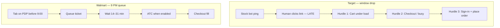

# Drop field observations (operator report)

**Source:** Boss field notes — Target + Walmart drops, 2025–2026 season  
**Purpose:** Ground product priorities in what actually happens on drop night, not idealized bot flows.

---

## Executive summary

| Retailer | Timing model | Primary gate | What “winning” looks like |
|----------|--------------|--------------|---------------------------|
| **Target** | **Hours-long window** — no fixed second | **Notification latency** → reactive click → crowded PDP | Item already **monitored** before ping; ATC + cart confirm under load; checkout without bounce |
| **Walmart** | **~9:00 PM ET** (Wednesday drops) | **Queue-it ticket** before ATC | Tab **on product page before 9:00**; enter queue early; **OID + WS** the instant ATC enables |

**Honest takeaway:** Target losses are mostly **reactive workflow** (ping → click → late). Walmart losses are mostly **queue position** (late entry or bad ticket), not checkout DOM speed after queue clears.

---

## Target — observed behavior

### What you see

1. **No set drop time** — releases happen inside a **multi-hour window**.
2. **Stock-bot notification is the gate** — you learn “live” from Discord/Twitter/etc., click the link, and by then the crowd is already on the SKU.
3. **Site degrades immediately** — hangs, slow SPA, kicks back to **product page** after ATC attempts.
4. **Three hurdles in sequence:**
   - **Hurdle 1:** Get item **in cart** (confirmed, not phantom ATC).
   - **Hurdle 2:** Reach **checkout** (`/checkout` loads or high-volume blocks).
   - **Hurdle 3:** **Complete checkout** (sign-in modal, “we’re busy”, empty-cart bounce, payment).

### How this maps to our extension today

| Hurdle | Your observation | What we already do | Gap |
|--------|------------------|-------------------|-----|
| **1 — Cart** | Link click too late; PDP hammered | Background **RedSky poll** on monitored URL; Shape pool for hype; **cart API confirm** before `ATC_SUCCESS` | **No webhook** from stock bots → you still click manually if not pre-monitoring |
| **1 — Cart** | Kicked back to PDP | `scheduleCheckoutRetry`, cart empty detection, session recovery (401 streak) | Reactive entry still loses vs always-on monitors |
| **2 — Checkout** | Cart won’t load / busy warnings | `probeTargetCart`, `goToCheckoutViaApiBypass`, `warmInitTargetCheckout`, high-volume poll-not-reload | Sign-in at checkout under load — **pre-auth 30+ min** still required |
| **3 — Complete** | Busy copy, bounce | High-volume handler on cart + checkout; fresh-tab (hype); BeatBots `checkout_request` opt-in | Full API checkout needs matching browser session + Shape pool |

### Target — product implications (prioritized)

1. **Pre-monitor beats ping-and-click**  
   Add SKU to monitor list **before** the window opens. Background poll fires navigation **without** waiting for you to open the notification link.

2. **Notification integration (future)**  
   Discord/webhook listener or “open this URL now” deep link from stock bot → extension navigates active Target tab in &lt;1s. Removes human click latency.

3. **Window mode vs point-in-time drop**  
   `dropExpectedAt` tightens polling in a **10m band** — wrong mental model for Target window drops. Consider **“monitor window”** (start/end) or “always aggressive while monitor ON” for unknown-window SKUs.

4. **Hurdle ordering matches our v2.2+ work**  
   Cart confirm → API bypass → checkout steps is the right stack; your field report validates that **checkout without cart confirm** was a root failure mode.

---

## Walmart — observed behavior

### What you see

1. **Drop time is predictable** — **~9:00 PM ET**; products visible but **gated by queue**.
2. **Normal entry = refresh** at go-time to get a queue ticket.
3. **Some bots appear to “skip” queue** — worth understanding what that actually means.
4. After queue: same checkout hurdles as any high-traffic site.

### Queue “bypass” — research (what’s real vs marketing)

Industry docs (Refract, AMNotify, Queue-it architecture) align on:

| Claim | Reality |
|-------|---------|
| “Bypass Queue-it” | **No reliable bypass** on Walmart’s **server-side** queue — ticket is issued server-side before ATC enables. |
| Bots that “skip queue” | Usually **multi-account parallelism**, **already on PDP at T-0**, or **OID ATC the millisecond** the button enables — not skipping the queue. |
| Client-side Queue-it tricks | Block JS / patch WebSocket — **does not grant a valid ticket**; at best breaks the page. |
| Faster than manual refresh | **Tab warm on `/ip/…` before 9:00**, NTP-synced **T-10s** load, **one profile per SKU**, **OID path** when ATC enables. |

**What looks like circumvention:**

- **Product-page queue** (ATC disabled = “pending”) vs **`/qp` waiting room** — same ticket system, different UI. We handle both (`wmWaitInProductQueue`, `wmHandleQueueRoom`).
- **Queue proxies** (Refract) — separate ISP IP for queue entry only; extension **cannot** do this without `chrome.proxy` + architecture.
- **Skip monitoring + OID spam** — Refract explicitly says **do NOT use for queue drops**; hurts queue drops. Our popup guide matches: Skip monitoring is for **non-queue** instant-live SKUs.

### How this maps to our extension today

| Your observation | Our behavior | Notes |
|------------------|--------------|-------|
| 9 PM drop | `dropExpectedAt` + tension window; popup guide **8:59:50** | Start monitor **~8:40** so tab is loaded before T-10m |
| Refresh to enter queue | Monitor opens product tab; **passive wait** on PDP | Better than cold refresh at 9:00:00 if tab already there |
| Queue position | `WALMART_IN_QUEUE` locks tab; **no background nav** | Reload **destroys** ticket — we block that |
| Faster when turn comes | `walmart-main-world.js` **Queue-it WebSocket** → `TCH_QUEUE_PASSED` | Sub-second vs 1s DOM poll |
| ATC when enabled | `wmDirectAtc(oid)` then DOM click fallback | OID saves 1–2s after queue clears |
| Skip monitoring ON at 9 PM | `rapidRetryMs` OID spam | **Wrong for queue drops** per Refract — keep OFF for Wednesday |

### Walmart — faster queue entry (research backlog)

Ranked by feasibility in **Chrome extension** (no proxy farm):

| # | Approach | Mechanism | Status |
|---|----------|-----------|--------|
| 1 | **Pre-loaded PDP** | Monitor tab on `/ip/…` before 9:00; server assigns ticket when drop opens | **Supported** — start monitor early |
| 2 | **NTP-aligned drop time** | `dropExpectedAt` at 8:59:50 local; tension polling | **Supported** — popup guide |
| 3 | **WS queue-pass signal** | React to Queue-it `queuePassed` before DOM enables ATC | **Shipped** — `walmart-main-world.js` |
| 4 | **OID instant ATC** | POST guest cart API when button enables | **Shipped** — `wmDirectAtc` |
| 5 | **Scheduled soft reload** | One reload at T-0 only if not yet in queue (risky — may lose ticket) | **Not implemented** — needs careful state machine |
| 6 | **Multi-profile** | N Chrome profiles = N independent queue tickets | **Ops** — `CHROME-PROFILES-RUNBOOK.md` |
| 7 | **Queue API reverse-engineer** | Direct POST to queue enrollment endpoint | **High risk** — brittle, ToS, PX; not planned without evidence |
| 8 | **Proxy per queue entry** | Residential/ISP queue IP | **Out of scope** for MV3 extension |

**Recommended operator playbook (Walmart 9 PM):**

1. One Chrome profile per product.
2. Monitor started **≥20 min early** (tab loaded, logged in, cart empty).
3. **Skip monitoring OFF** for queue drops.
4. **OID filled** + max price set.
5. Drop time **8:59:50** — hands off in tension window.
6. Do not reload tab once “In queue” toast shows.

---

## Cross-retailer comparison (your experience)

**Target** bottleneck = **information + reaction time** + **site health at cart/checkout**.  
**Walmart** bottleneck = **queue ticket timing** + **patience**; checkout is usually easier if you clear queue.

---

## Suggested engineering backlog (from field report)

### P0 — aligns with your pain

| Item | Retailer | Solves |
|------|----------|--------|
| Pre-monitor SKU URLs (no ping required) | Target | Hurdle 1 before crowd |
| Cart API confirm + bypass (shipped v2.2+) | Target | Hurdle 1–2 under load |
| Walmart early monitor + queue lock (shipped) | Walmart | Faster queue entry vs 9:00 refresh |
| Pre-auth + saved payment | Target | Hurdle 3 sign-in |

### P1 — new work

| Item | Retailer | Solves |
|------|----------|--------|
| Discord/webhook “go live” → extension navigate | Target | Notification click latency |
| Monitor **window mode** (hours, not datetime point) | Target | Window drops |
| Optional T-0 single reload if not `in_queue` | Walmart | Edge case: tab wasn’t in queue at open |
| Queue ticket / position telemetry in popup | Walmart | Visibility into “unlikely” vs “likely” |

### P2 — research only

| Item | Notes |
|------|-------|
| Walmart queue enrollment API | Only if captured from HAR during live drop |
| True multi-session from one extension | Needs profile orchestration, not one tab |

---

## Related docs

- `docs/autopilot/stock-monitor-research/stock-monitor-research.md` — how stock bots detect restocks; Phase 1 plan
- `docs/autopilot/checkout-reliability/CHECKOUT-BYPASS-RESEARCH.md`
- `docs/autopilot/anti-detection/ANTI-DETECTION-RESEARCH-PLAN.md`
- `docs/autopilot/target-toolstack/CHROME-PROFILES-RUNBOOK.md`
- Popup **Walmart — Drop guide** (`popup.html`)

---

*This doc should be updated after each drop with timestamps, SKUs, and which hurdle failed.*
