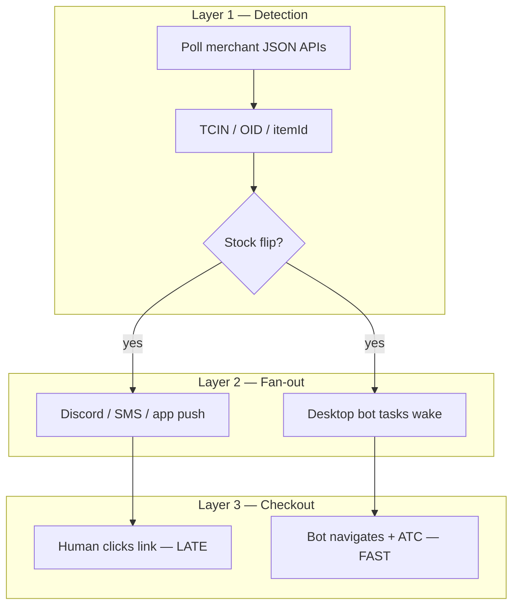

# PRD: How stock bots track restocks — research & adoption plan

## Introduction

Paid “stock bots” and cook-group monitors (Poke Signals, Refract monitors, Stellar tasks, Apify actors, etc.) alert you when Target or Walmart inventory flips. **You already use the same core technique on Target** — RedSky fulfillment JSON polling — but commercial stacks add **scale** (many IPs, always-on servers) and **workflow** (PID lists, Discord fan-out) that beat **human notification → click link**.

This PRD documents **how restock detection actually works**, compares it to **our extension**, and defines a **minimal adoption plan** so you can pre-monitor window drops without waiting on Discord pings.

**Primary reader:** Operator + `@it` implementing monitor improvements.  
**Starting point for this effort** — other backlog items (monitor window UI, queue telemetry) are deferred until this is understood and Phase 1 ships.

---

## Goals

1. Explain restock detection in plain language (Target RedSky, Walmart item JSON, commercial monitor farms).
2. Map each technique to **existing code** vs **gap**.
3. Define **Phase 1** changes that close the “notification gate” without Discord webhooks.
4. Keep drop-window performance (250ms tension polling when armed).

---

## How commercial restock tracking works

### The three-layer ecosystem

| Layer | Who | What they do |
|-------|-----|----------------|
| **1 — Detection** | Monitor service, bot “monitor task”, our `background.js` | Poll inventory APIs on an interval; detect OOS → in-stock transition |
| **2 — Fan-out** | Cook groups, Refract/Stellar orchestrator | Push alert or wake checkout tasks |
| **3 — Checkout** | You, or checkout task | Navigate PDP, ATC, cart, checkout |

**Your Target pain** is Layer 2→3 when you rely on Discord: Layer 1 already happened minutes or seconds earlier on someone else’s infra; you only get Layer 2 as a ping.

---

## Target — technical deep dive

### Identifier: TCIN (Product ID / PID)

- Every Target PDP URL contains `A-{TCIN}` (e.g. `…/A-94300072` → TCIN `94300072`).
- Refract/Stellar monitor inputs use **TCIN only**, not full URL ([Refract monitor docs](https://help.refractbot.com/general-setup/task-creation/monitor-setup-and-multi-input)).
- We extract TCIN in `extractTcin()` / `extractTcinFromUrl()` (`background.js`, `content.js`).

### API: RedSky (Target’s own backend)

Target’s site loads stock from **`redsky.target.com`** — the same JSON the PDP uses. Public reverse-engineering ([LumaDevelopment gist](https://gist.github.com/LumaDevelopment/f2a34a202fed6ab5a7f3a31282834943), scraping guides) documents:

| Endpoint | Use |
|----------|-----|
| `redsky_aggregations/v1/web/product_fulfillment_v1` | Single TCIN — **authoritative for preorders** |
| `redsky_aggregations/v1/web/product_summary_with_fulfillment_v1` | Batch TCINs — efficient multi-SKU |
| `product_fulfillment_and_variation_hierarchy_v1` | Geo-specific store + ship ATP (scrapers) |
| `plp_search_v2` | Keyword search → discover TCINs (catalog monitors) |

**Required params (typical):**

- `key` — web API key (rotates; embedded in `window.__CONFIG__.services`)
- `tcin` — product id
- Often also: `store_id`, `zip`, `latitude`, `longitude`, `pricing_store_id` for **location-accurate** ATP

We currently poll with **`key` + `tcin`** and `credentials: 'include'` (`checkSingleTcin`, `checkTcinsStock` in `background.js`). Browser cookies may supply guest location; **we do not explicitly pass zip/store** like server-side scrapers do — possible gap for geo-sensitive drops.

### Stock signals (what “in stock” means)

From `parseFulfillmentBlock` / `parseFulfillmentStockStatus` (`content.js`, `background.js`):

| Field | Meaning |
|-------|---------|
| `shipping_options.availability_status` | `IN_STOCK`, `OUT_OF_STOCK`, `PRE_ORDER_SELLABLE`, etc. |
| `shipping_options.available_to_promise_quantity` | ATP qty (used for **high stock only** filter) |
| `fulfillment.sold_out` | Hard sold out |
| `fulfillment.is_out_of_stock_in_all_store_locations` | All stores OOS |
| `product.price.*` | Retail price for **max price** gate |

**Transition detection:** Monitors store last state; **edge** OOS→in-stock (or qty crossing threshold) triggers alert or navigation. We navigate on `stock === true` when monitor is active (`runBackgroundPoll` → `chrome.tabs.update`).

### API key sourcing

| Source | Used by |
|--------|---------|
| `window.__CONFIG__.services.auth.apiKey` | Browser / extension (`main_world.js` → `dataset.tchKey`) |
| Hardcoded / rotated keys in scraper configs | Apify actors, some open-source tools |
| Cached in `chrome.storage.local.bgApiKey` | Our service worker survives restarts |

### Polling cadence (why paid monitors feel faster)

| Operator | Typical interval | IPs |
|----------|------------------|-----|
| Refract monitor (documented) | **3.5–4s** per SKU ([proxy guide](https://unknownproxies.com/blog/guides/refract-bot-target-guide-best-proxies-and-setup-for-success)) | **1 ISP proxy per monitor input** |
| Stellar (documented) | **8–15s** | Many tasks × proxies |
| Apify / server scrapers | Batch + residential rotation | **Hundreds** of IPs |
| **Our extension** | **250ms–2s** background sleep in tension window; **500ms–2s** otherwise | **1** browser IP |

**Insight:** We are **faster per cycle** than Refract’s documented 3.5s when tension window is armed. Paid monitors win on **always-on + many IPs + SKU lists maintained by cook groups**, not on raw poll interval alone.

### Anti-bot on *monitoring* (not ATC)

- RedSky returns **401/403** when PerimeterX/Akamai rejects session → our `redskyErrorStreak` + session recovery.
- Server farms use **residential proxies**, TLS fingerprinting (`curl_cffi`), jittered delays.
- **Monitoring** is lower risk than ATC; Shape cookies are **not** required for fulfillment GET — only for protected cart/login POST.

---

## Walmart — technical deep dive (brief)

| Piece | Mechanism |
|-------|-----------|
| ID | Item ID in `/ip/…/{itemId}`; **OID** for direct cart API |
| Stock check | `GET /item/json/{itemId}` → `productAvailability.availabilityStatus` (`checkWalmartItemStock`) |
| 9 PM drop | Queue-it on PDP; not a stock API problem until queue clears |
| “Faster than refresh” | Pre-loaded tab + `WALMART_IN_QUEUE` lock + WS queue-pass — see field-observations doc |

Walmart Wednesday is **queue-gated**, not “hidden stock API” gated. Stock monitors matter less than **queue entry time**.

---

## Comparison: stock bot vs our extension

| Capability | Commercial monitor + bot | Our extension (today) |
|------------|------------------------|------------------------|
| Target API | RedSky fulfillment | **Same** — `product_fulfillment_v1` + batch |
| Multi-SKU | Tag groups / multi-input | `monitor.products[]` |
| Always-on | 24/7 server or desktop app | Only while **monitor active** + Chrome open |
| Alert fan-out | Discord, etc. | None (direct tab nav) |
| Proxies | 1:1 ISP per SKU common | Single IP |
| Window drops (hours) | Implicit (always polling) | `dropExpectedAt` point model — **mismatch** |
| Geo ATP | Explicit zip/store in URL | Cookie session only — **possible gap** |
| After detect | Separate checkout task | Same tab ATC → checkout |

**Bottom line:** For Target, you don’t need a different *detection algorithm* to match stock bots — you need **(a)** monitor running **before** the window, **(b)** optional geo params, **(c)** optional “aggressive window” mode for unknown drop times.

---

## User stories

1. **As a Target drop user**, I add TCINs to monitor and leave extension on during the **whole window**, so I don’t depend on Discord speed.
2. **As a developer**, I can read one doc explaining RedSky fields and our parsers.
3. **As @it**, I implement monitor-window mode and geo params without breaking tension polling.

---

## Requirements (implementation phases)

### Phase 0 — Research & documentation (this PRD)

- Document RedSky endpoints, signals, commercial patterns.
- Link to code map.

### Phase 1 — Close the notification gap (extension-only)

| ID | Requirement |
|----|-------------|
| 1.1 | **Monitor window mode**: `monitorWindowStart` / `monitorWindowEnd` OR “aggressive while monitor ON” for Target — poll at tension cadence for entire window, not only ±10m around `dropExpectedAt` |
| 1.2 | **Geo fulfillment params**: optional zip + store_id on RedSky URLs (from saved shipping zip or guest store cookie) |
| 1.3 | **Stock transition log**: log OOS→in-stock with timestamp in `checkoutTelemetry` for post-drop review |
| 1.4 | **Operator doc**: “Pre-monitor beats Discord” playbook in popup guide |

### Phase 2 — Detection hardening

| ID | Requirement |
|----|-------------|
| 2.1 | Audit batch vs single-TCIN fallback (already exists) — add Node fixture tests from captured RedSky JSON |
| 2.2 | `plp_search_v2` keyword watch (optional) — discover TCIN from search term for unannounced SKUs |
| 2.3 | Compare ATP vs `availability_status` flicker — debounce N-of-M polls before navigate |

### Phase 3 — Scale (optional, beatbots-app or sidecar)

| ID | Requirement |
|----|-------------|
| 3.1 | Headless RedSky poller in `beatbots-app` with residential proxy list — feeds extension via WS `stock_flip` message |
| 3.2 | Multi-profile orchestration doc only (no proxy in extension) |

---

## Non-goals

- Discord/webhook integration (explicitly out of scope per user).
- Scraping Target at datacenter scale without proxies.
- Walmart queue bypass research (separate track — `DROP-FIELD-OBSERVATIONS.md`).
- Circumventing Shape on monitor GETs (not needed).

---

## Technical considerations

- **Files today:** `background.js` (`runBackgroundPoll`, `checkTcinsStock`), `dropPollingTiming.js`, `content.js` (`parseFulfillmentStockStatus`, `buildFulfillmentApiUrl`), `main_world.js` (API key).
- **Do not** slow 250ms tension polling when drop is armed.
- **401/403:** Keep `redskyErrorStreak` + session recovery; geo/zip changes may affect PX rate limits — test on live PDP.
- **Legal:** Monitoring public product availability via same APIs as the site is in the same class as commercial tools; document ToS risk, no guarantees.

---

## Success metrics

| Metric | Target |
|--------|--------|
| Operator understands RedSky vs Discord | This doc + popup guide |
| Window drop without `dropExpectedAt` | Phase 1.1 — monitor stays aggressive for configured hours |
| Detection latency vs manual ping | Tab navigates within one background poll cycle of RedSky flip |
| Post-drop debug | Phase 1.3 — telemetry shows flip time |

---

## Deferred backlog (from field report — not this PRD)

- Discord webhook navigate (declined)
- Walmart queue ticket telemetry
- T-0 queue entry helper
- BeatBots full API checkout WS (shipped opt-in)

---

## References

- `tasks/stellar-vs-us-comparison.md` — monitor API mode
- `docs/autopilot/field-observations/DROP-FIELD-OBSERVATIONS.md`
- `research_target_checkout_bots/findings_technical_patterns.md`
- [Refract Target module](https://help.refractbot.com/modules/target)
- [RedSky gist](https://gist.github.com/LumaDevelopment/f2a34a202fed6ab5a7f3a31282834943)
