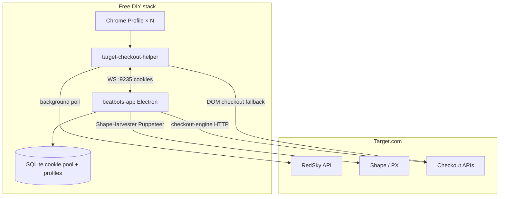

# Target DIY toolstack — build concept (no AYCD)

**Boss:** @it | **Date:** 2026-06-27 | **Constraint:** $0 recurring — build or use free primitives only

---

## Executive summary

You do **not** need AYCD ($30–65/mo) for Target if you accept a **two-layer stack** you mostly already have:

| Layer | Role | Cost |
|-------|------|------|
| **`target-checkout-helper/`** | Monitor, RedSky poll, DOM checkout, passive cookie harvest, CDP input | $0 |
| **`beatbots-app/`** | Shape cookie generation, API login/OTP, API checkout, profiles, cookie pool DB | $0 (local Electron) |
| **Chrome profiles** | One account per profile = poor man's TabSentry | $0 |

**AYCD is a convenience bundle.** Our repo already contains ~70% of the same surface area in `beatbots-app`; the gap is **wiring + polish**, not greenfield invention.

**Do not build:** Traffic/SEO farming, captcha-solving SaaS clone, VCC issuer, or a full TabSentry UI clone. Use Chrome profiles + extension for multi-session.

---

## What Target actually needs (ranked)

From `stellar-vs-us-comparison.md`, rehearsal failures, and overnight bug hunts:

| Need | Why | Paid shortcut (skip) | DIY answer |
|------|-----|----------------------|------------|
| **1. Shape-ready ATC cookies** | Hype drops block passive cookies | Stellar/Refract harvesters | `beatbots-app` **ShapeHarvester** |
| **2. Pre-auth before checkout** | Auth modal kills speed under automation | Pre-login tasks | Extension warmup + app **SessionManager** token |
| **3. Fast monitor → ATC** | Restock window is seconds | Bot monitor | Extension **background poll** (have) |
| **4. OTP / 2FA** | Target emails codes | AYCD Inbox | App **IMAP profiles** + extension Gmail OAuth / native IMAP |
| **5. Profiles + address jig** | Cancellations, per-account data | Profile Builder | App **Profiles** + `core/jigAddress.js` |
| **6. Checkout speed** | DOM is slow | API checkout bots | App **checkout-engine.ts** |
| **7. Multi-account** | More hits per drop | TabSentry × N | **Chrome profiles** × extension (manual) |
| **8. Captcha at login** | Bot friction | AutoSolve AI | **Avoid** — real Chrome + warm session; manual fallback |
| **9. Notifications** | Know when you hit review | Discord in Refract | Extension **Discord webhook** (have) |
| **10. Proxies** | Scale / ban isolation | Residential lists | App **Proxies** page (optional; single-IP OK for 1 account) |

---

## AYCD product → DIY build map

```
┌─────────────────────────────────────────────────────────────────┐
│  AYCD Ultimate ($65/mo)          →  BEATBOTS DIY ($0)           │
├─────────────────────────────────────────────────────────────────┤
│  TabSentry (multi-browser)       →  Chrome user profiles        │
│                                     + extension per profile       │
│  Profile Builder                 →  beatbots-app Profiles UI    │
│                                     + popup sync (wire)           │
│  Inbox (OTP API)                 →  beatbots-app ImapProfiles     │
│                                     + session-manager OTP poll    │
│                                     + extension Gmail OAuth       │
│  AutoSolve / captcha             →  DON'T BUILD — use real Chrome │
│  OneClick (Gmail trust)          →  Manual warm-up checklist      │
│  Shape / ATC cookies             →  beatbots-app ShapeHarvester │
│  Checkout task                   →  extension DOM OR app API eng. │
└─────────────────────────────────────────────────────────────────┘
```

---

## Architecture (target state)



**Modes of operation:**

| Mode | When | Components |
|------|------|------------|
| **Lite** | 1 account, moderate drops | Extension only |
| **Standard** | Hype / Shape blocks | Extension monitor + app Shape pool + apply harvest |
| **Fast** | API path stable | App monitor task + checkout-engine; extension optional |
| **Scale** | Multi-account | N Chrome profiles, each Lite/Standard |

---

## What already exists in the repo

### Extension (`target-checkout-helper/`)

- RedSky background monitor, drop timing, session recovery
- Passive + ATC cookie harvest → `chrome.storage.session`
- DOM checkout, saved payment, auto sign-in, auth warmup (recent)
- Gmail OTP, Walmart IMAP native host, Discord webhooks
- WS client to beatbots-app (`background.js` BB bridge)

### Desktop app (`beatbots-app/`)

| Module | File | AYCD equivalent |
|--------|------|-----------------|
| Shape harvester | `engines/shape-harvester.ts` | Active cookie gen (core gap vs extension-only) |
| Session + OTP | `engines/session-manager.ts` | Inbox + pre-login |
| API checkout | `engines/checkout-engine.ts` | Refract/Stellar checkout task |
| Cookie pool | `models/cookie-pool.ts` | Cookie queue |
| IMAP OTP | `pages/ImapProfiles.tsx` | Inbox mail tasks |
| Profiles | `pages/Profiles.tsx` | Profile Builder |
| Proxies | `pages/Proxies.tsx` | TabSentry proxy column |
| Accounts | `pages/Accounts.tsx` | Account list |
| Extension bridge | `engines/ws-bridge.ts` | N/A (our edge) |
| Monitor | `engines/monitor.ts` | Monitor task |

**Verdict:** Building "AYCD-like tools" = **finish and wire beatbots-app**, not start a third product.

---

## Build phases (conceptual — no calendar estimates)

### Phase 0 — Extension-only (tonight, $0)

**Already shippable.** No app required for Tier A Target SKUs with high stock.

- 1 Chrome profile, extension ON, saved payment, sign in early
- Optional passive harvest pool
- Manual Place Order at review

### Phase 1 — Wire extension ↔ app (highest ROI)

**Goal:** Shape pool visible and consumable from extension before monitor ATC.

| # | Build | Owner |
|---|-------|-------|
| 1.1 | Extension popup: "Start Shape harvest" → WS message to app | extension + app |
| 1.2 | App pushes pool depth / freshness to popup via WS | app |
| 1.3 | On monitor ATC: prefer app pool cookie inject over passive harvest | extension `cookieHarvest.js` |
| 1.4 | Document: run app + extension together (`docs/` runbook) | docs |

**Acceptance:** Hype mode gate passes when app pool ≥ 1; ATC uses Shape cookie.

### Phase 2 — Unified OTP (replace three paths)

Today: Gmail OAuth (Target), native IMAP (Walmart), manual.

| # | Build | Owner |
|---|-------|-------|
| 2.1 | Single `OtpProvider` interface in app: `poll(email, since) → code` | app |
| 2.2 | Implement IMAP provider (reuse `session-manager` logic) | app |
| 2.3 | Extension `START_OTP_WATCH` → WS to app when app connected | extension |
| 2.4 | Keep Gmail OAuth as fallback when app offline | extension |

**Acceptance:** Target login MFA works with only app IMAP profile configured.

### Phase 3 — Profile sync

| # | Build | Owner |
|---|-------|-------|
| 3.1 | Export app profile → extension `chrome.storage.local` JSON | app IPC + extension message |
| 3.2 | CSV import in app (column map from popup fields) | app Profiles |
| 3.3 | `jigIndex` / `jigAddress.js` shared semantics | core/ |

**Acceptance:** One profile edit in app appears in extension popup after sync.

### Phase 4 — API checkout path (speed tier)

| # | Build | Owner |
|---|-------|-------|
| 4.1 | Monitor ping → app `checkout-engine` instead of DOM nav | app task-runner |
| 4.2 | Extension defers to app when `beatbotsCheckoutMode: api` | extension + app |
| 4.3 | Shape retry + pool consume aligned with engine | app |

**Acceptance:** End-to-end API checkout on test TCIN in dev (no real charge).

### Phase 5 — Multi-account (free TabSentry)

**Do not build a browser farm UI.** Operational pattern:

| # | Approach |
|---|----------|
| 5.1 | Document Chrome profile per Target account |
| 5.2 | Each profile: load same unpacked extension |
| 5.3 | Optional: app launches Chrome with `--profile-directory=` + harvester per account |
| 5.4 | Discord webhook per profile or single channel with profile tag |

**Acceptance:** 2 profiles run 2 monitors without cookie cross-contamination.

---

## Explicitly NOT building

| AYCD-like feature | Why skip |
|-------------------|----------|
| **AutoSolve / AI captcha service** | Costs money at scale; real Chrome + warm session is the free path; captcha APIs are paid |
| **Traffic & SEO / OneClick farming** | Off-target; ToS risk; marginal for checkout |
| **VCC generator** | Requires paid issuer APIs (Privacy, Capital One, etc.) — integrate later if user has cards |
| **TabSentry clone** | Chrome profiles + Puppeteer in app suffice |
| **SMS verify platform** | Only if Walmart SMS drops matter; defer |
| **Webhook scraper SaaS** | Extension Discord webhook + optional email scrape in app |

---

## Captcha reality (honest)

Free stack **cannot** reliably auto-solve Target login captchas like AutoSolve AI.

**Free mitigations:**

1. Sign in **hours before** drop (extension warmup + human session)
2. Use **real Chrome** (extension in normal profile, not headless monitor)
3. **CDP typing** only after human passed any initial challenge
4. If "Something went wrong" banner → pause automation (we implemented this)

If captcha frequency increases, the only paid lever is a **per-solve API** (2Captcha, etc.) — budget item, not a build item.

---

## Tonight's Target drop (3–5 AM) — free minimum

**Without spending anything or running beatbots-app:**

1. Extension from `main` or PR #20
2. One Chrome profile, signed in by 2:30 AM
3. Monitor 2–3 high-stock zephyr SKUs
4. Saved payment ON, auto place order OFF
5. Manual sign-in at checkout if prompted

**If you can run beatbots-app locally (still $0):**

1. Start Shape harvester 30–60 min before window on a cheap in-stock TCIN
2. Keep extension **Apply before checkout** ON
3. Extension monitor fires ATC when pool has entries

---

## Success metrics (how we know DIY works)

| Metric | Lite (ext) | Standard (+ app) |
|--------|------------|------------------|
| Monitor → ATC latency | &lt; 3s after RedSky in-stock | Same |
| Checkout → review | DOM timing in popup | API &lt; 2s (app) |
| Shape block rate | High on hype without app | Low with fresh pool |
| OTP manual intervention | Rare if signed in early | Auto via IMAP |
| Monthly cost | $0 | $0 |

---

## Autopilot follow-up (build loop)

When ready to implement (not buy AYCD):

```bash
./scripts/loop.sh --task docs/autopilot/target-toolstack/diy-toolstack.json --detach
```

See `diy-toolstack.json` for Phase 1–3 requirements.

---

## Decisions (@it)

1. **AYCD integration task pivots to DIY** — brainstorm remains valid as "what not to buy."
2. **beatbots-app is the build target** for Inbox/Profile/Shape/Checkout — not new repos.
3. **Extension stays the default UX** for single-account users; app is power-user layer.
4. **No paid captcha** in v1; document manual fallback.
5. **Chrome profiles** are the multi-account answer until Phase 5 automation.

---

## References

- `tasks/stellar-vs-us-comparison.md`
- `beatbots-app/src/main/engines/shape-harvester.ts`
- `beatbots-app/src/main/engines/checkout-engine.ts`
- `beatbots-app/src/main/engines/session-manager.ts`
- `docs/autopilot/aycd-integration/AYCD-RESEARCH-BRAINSTORM.md` (paid alternative analysis)
- `docs/autopilot/checkout-improvements/CHECKOUT-RESEARCH-BRAINSTORM.md`
